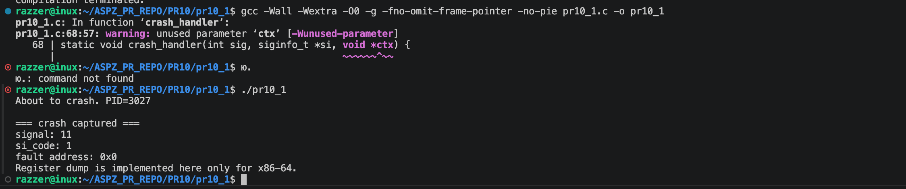
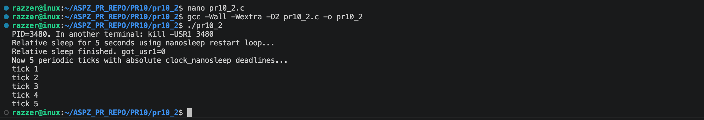
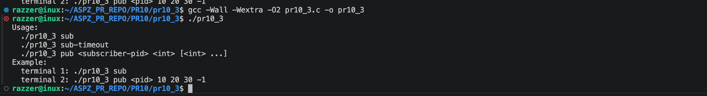
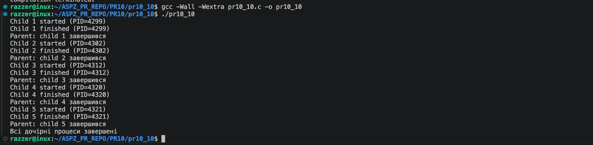

Практична робота №9

Завдання 1

Файл: crash_diag.c
#define _GNU_SOURCE
#include <errno.h>
#include <signal.h>
#include <stdint.h>
#include <string.h>
#include <sys/ucontext.h>
#include <ucontext.h>
#include <unistd.h>
#include <stdlib.h>

static void wr_all(const char *s, unsigned long n) {
    while (n > 0) {
        ssize_t r = write(STDERR_FILENO, s, n);
        if (r <= 0) return;
        s += r;
        n -= (unsigned long)r;
    }
}

static void wr(const char *s) {
    unsigned long n = 0;
    while (s[n] != '\0') n++;
    wr_all(s, n);
}

static void wr_ch(char c) {
    wr_all(&c, 1);
}

static void wr_dec(long v) {
    char buf[32];
    int i = 0;
    unsigned long x;

    if (v < 0) {
        wr_ch('-');
        x = (unsigned long)(-(v + 1)) + 1UL;
    } else {
        x = (unsigned long)v;
    }

    do {
        buf[i++] = (char)('0' + (x % 10));
        x /= 10;
    } while (x != 0 && i < (int)sizeof(buf));

    while (i > 0) wr_ch(buf[--i]);
}

static void wr_hex(uint64_t v) {
    static const char hex[] = "0123456789abcdef";
    int started = 0;

    wr("0x");
    for (int shift = 60; shift >= 0; shift -= 4) {
        unsigned int nib = (unsigned int)((v >> shift) & 0xfU);
        if (nib != 0 || started || shift == 0) {
            wr_ch(hex[nib]);
            started = 1;
        }
    }
}

static void wr_ptr(const void *p) {
    wr_hex((uint64_t)(uintptr_t)p);
}

static void crash_handler(int sig, siginfo_t *si, void *ctx) {
    int saved_errno = errno;

    wr("\n=== crash captured ===\n");
    wr("signal: ");
    wr_dec(sig);
    wr("\n");

    if (si != NULL) {
        wr("si_code: ");
        wr_dec((long)si->si_code);
        wr("\n");

        wr("fault address: ");
        wr_ptr(si->si_addr);
        wr("\n");
    }

#if defined(__x86_64__)
    if (ctx != NULL) {
        ucontext_t *uc = (ucontext_t *)ctx;
        greg_t *g = uc->uc_mcontext.gregs;

        wr("RIP: "); wr_hex((uint64_t)g[REG_RIP]); wr("\n");
        wr("RSP: "); wr_hex((uint64_t)g[REG_RSP]); wr("\n");
        wr("RBP: "); wr_hex((uint64_t)g[REG_RBP]); wr("\n");
        wr("RAX: "); wr_hex((uint64_t)g[REG_RAX]); wr("\n");
        wr("RBX: "); wr_hex((uint64_t)g[REG_RBX]); wr("\n");
        wr("RCX: "); wr_hex((uint64_t)g[REG_RCX]); wr("\n");
        wr("RDX: "); wr_hex((uint64_t)g[REG_RDX]); wr("\n");
        wr("RSI: "); wr_hex((uint64_t)g[REG_RSI]); wr("\n");
        wr("RDI: "); wr_hex((uint64_t)g[REG_RDI]); wr("\n");
    }
#else
    wr("Register dump is implemented here only for x86-64.\n");
#endif

    errno = saved_errno;

    /*
     * Для production можна замість _exit() скинути handler на default
     * і повторно підняти сигнал, щоб отримати core dump.
     * Для навчального прикладу завершуємося простим exit status 128+sig.
     */
    _exit(128 + sig);
}

static void install_crash_handlers(void) {
    struct sigaction sa;
    memset(&sa, 0, sizeof(sa));

    sa.sa_sigaction = crash_handler;
    sigemptyset(&sa.sa_mask);
    sa.sa_flags = SA_SIGINFO | SA_RESETHAND;

    sigaction(SIGSEGV, &sa, NULL);
    sigaction(SIGBUS,  &sa, NULL);
    sigaction(SIGFPE,  &sa, NULL);
    sigaction(SIGILL,  &sa, NULL);
    sigaction(SIGABRT, &sa, NULL);
}

__attribute__((noinline))
static void crash_here(void) {
    volatile int *p = (int *)0;
    *p = 42;
}

int main(void) {
    install_crash_handlers();

    wr("About to crash. PID=");
    wr_dec((long)getpid());
    wr("\n");

    crash_here();
    return 0;
}

Компіляція і запуск:
gcc -Wall -Wextra -O0 -g -fno-omit-frame-pointer -no-pie crash_diag.c -o crash_diag
./crash_diag

Пошук рядка за RIP:
addr2line -e ./crash_diag -f -C 0x40171f

Опис

Програма демонструє обробку аварійних сигналів у Linux за допомогою sigaction з прапором SA_SIGINFO. При виникненні помилки (наприклад, SIGSEGV) обробник виводить інформацію про сигнал, адресу помилки та значення регістрів процесора (RIP, RSP, RAX тощо). Це дозволяє діагностувати причину збою без використання зовнішніх дебагерів.

Приклад роботи

============================================================================================

Завдання 2

Файл: sleep_correct.c
#define _POSIX_C_SOURCE 200809L
#include <errno.h>
#include <signal.h>
#include <stdio.h>
#include <string.h>
#include <time.h>
#include <unistd.h>

static volatile sig_atomic_t got_usr1 = 0;

static void on_usr1(int sig) {
    (void)sig;
    got_usr1 = 1;
}

static int sleep_relative_ms(long ms) {
    struct timespec req = {
        .tv_sec = ms / 1000,
        .tv_nsec = (ms % 1000) * 1000000L
    };
    struct timespec rem;

    while (nanosleep(&req, &rem) == -1) {
        if (errno == EINTR) {
            req = rem;
            continue;
        }
        return -1;
    }

    return 0;
}

static void add_ms(struct timespec *t, long ms) {
    t->tv_sec += ms / 1000;
    t->tv_nsec += (ms % 1000) * 1000000L;

    while (t->tv_nsec >= 1000000000L) {
        t->tv_sec++;
        t->tv_nsec -= 1000000000L;
    }
}

static int sleep_periodic_absolute(struct timespec *deadline, long period_ms) {
    int rc;

    add_ms(deadline, period_ms);

    while ((rc = clock_nanosleep(CLOCK_MONOTONIC,
                                 TIMER_ABSTIME,
                                 deadline,
                                 NULL)) == EINTR) {
        /*
         * Reuse the same absolute deadline after a signal.
         * Це не накопичує drift так, як relative sleep loop.
         */
    }

    if (rc != 0) {
        errno = rc;
        return -1;
    }

    return 0;
}

int main(void) {
    struct sigaction sa;
    memset(&sa, 0, sizeof(sa));

    sa.sa_handler = on_usr1;
    sigemptyset(&sa.sa_mask);

    if (sigaction(SIGUSR1, &sa, NULL) == -1) {
        perror("sigaction");
        return 1;
    }

    printf("PID=%ld. In another terminal: kill -USR1 %ld\n",
           (long)getpid(), (long)getpid());

    puts("Relative sleep for 5 seconds using nanosleep restart loop...");
    if (sleep_relative_ms(5000) == -1) {
        perror("nanosleep");
        return 1;
    }

    printf("Relative sleep finished. got_usr1=%d\n", got_usr1);

    puts("Now 5 periodic ticks with absolute clock_nanosleep deadlines...");

    struct timespec next;
    if (clock_gettime(CLOCK_MONOTONIC, &next) == -1) {
        perror("clock_gettime");
        return 1;
    }

    for (int i = 1; i <= 5; i++) {
        if (sleep_periodic_absolute(&next, 1000) == -1) {
            perror("clock_nanosleep");
            return 1;
        }
        printf("tick %d\n", i);
    }

    return 0;
}

Компіляція:
gcc -Wall -Wextra -O2 sleep_correct.c -o sleep_correct
./sleep_correct

В іншому терміналі:
kill -USR1 <pid>

Опис

Програма показує правильне використання функцій nanosleep() та clock_nanosleep(). У першому випадку реалізовано цикл для відновлення сну після переривання сигналом (EINTR). У другому — використовується абсолютний час (TIMER_ABSTIME), що дозволяє уникнути накопичення похибки (drift) при періодичних затримках.

Приклад роботи

============================================================================================

Завдання 3

Файл: rt_pubsub.c
#define _POSIX_C_SOURCE 200809L
#include <errno.h>
#include <signal.h>
#include <stdio.h>
#include <stdlib.h>
#include <string.h>
#include <unistd.h>

static void die(const char *msg) {
    perror(msg);
    exit(EXIT_FAILURE);
}

static long parse_long(const char *s, const char *what) {
    char *end = NULL;
    errno = 0;

    long v = strtol(s, &end, 10);

    if (errno != 0 || end == s || *end != '\0') {
        fprintf(stderr, "invalid %s: %s\n", what, s);
        exit(EXIT_FAILURE);
    }

    return v;
}

static int app_signal(void) {
    int sig = SIGRTMIN;

    if (sig > SIGRTMAX) {
        fprintf(stderr, "No available real-time signal\n");
        exit(EXIT_FAILURE);
    }

    return sig;
}

static void usage(const char *prog) {
    fprintf(stderr,
        "Usage:\n"
        "  %s sub\n"
        "  %s sub-timeout\n"
        "  %s pub <subscriber-pid> <int> [<int> ...]\n"
        "Example:\n"
        "  terminal 1: %s sub\n"
        "  terminal 2: %s pub <pid> 10 20 30 -1\n",
        prog, prog, prog, prog, prog);
}

static void subscriber(int use_timeout) {
    int sig = app_signal();

    sigset_t set;
    sigemptyset(&set);
    sigaddset(&set, sig);

    /*
     * Important:
     * Signal must be blocked before sigwaitinfo/sigtimedwait,
     * otherwise it can be delivered by default disposition or a handler.
     */
    if (sigprocmask(SIG_BLOCK, &set, NULL) == -1) {
        die("sigprocmask");
    }

    printf("subscriber PID=%ld, waiting for signal %d (SIGRTMIN)\n",
           (long)getpid(), sig);
    fflush(stdout);

    for (;;) {
        siginfo_t si;
        memset(&si, 0, sizeof(si));

        int r;

        if (use_timeout) {
            struct timespec ts = {
                .tv_sec = 5,
                .tv_nsec = 0
            };
            r = sigtimedwait(&set, &si, &ts);
        } else {
            r = sigwaitinfo(&set, &si);
        }

        if (r == -1) {
            if (errno == EINTR) {
                continue;
            }

            if (use_timeout && errno == EAGAIN) {
                puts("timeout: no messages for 5 seconds");
                continue;
            }

            die(use_timeout ? "sigtimedwait" : "sigwaitinfo");
        }

        int value = si.si_value.sival_int;

        printf("received signal=%d value=%d from pid=%ld uid=%ld\n",
               r,
               value,
               (long)si.si_pid,
               (long)si.si_uid);
        fflush(stdout);

        if (value < 0) {
            puts("negative value received: shutting down subscriber");
            break;
        }
    }
}

static void publisher(pid_t pid, int argc, char **argv) {
    int sig = app_signal();

    for (int i = 3; i < argc; i++) {
        union sigval value;
        value.sival_int = (int)parse_long(argv[i], "message value");

        if (sigqueue(pid, sig, value) == -1) {
            die("sigqueue");
        }

        printf("sent value=%d to pid=%ld via signal=%d\n",
               value.sival_int,
               (long)pid,
               sig);
    }
}

int main(int argc, char **argv) {
    if (argc < 2) {
        usage(argv[0]);
        return EXIT_FAILURE;
    }

    if (strcmp(argv[1], "sub") == 0) {
        subscriber(0);
    } else if (strcmp(argv[1], "sub-timeout") == 0) {
        subscriber(1);
    } else if (strcmp(argv[1], "pub") == 0) {
        if (argc < 4) {
            usage(argv[0]);
            return EXIT_FAILURE;
        }

        pid_t pid = (pid_t)parse_long(argv[2], "PID");
        publisher(pid, argc, argv);
    } else {
        usage(argv[0]);
        return EXIT_FAILURE;
    }

    return EXIT_SUCCESS;
}

Компіляція:
gcc -Wall -Wextra -O2 rt_pubsub.c -o rt_pubsub

Термінал 1 — subscriber:
./rt_pubsub sub

Термінал 2 — publisher:
./rt_pubsub pub <PID_SUBSCRIBER> 10 20 30 -1

Варіант із timeout:
./rt_pubsub sub-timeout

Опис

Програма реалізує просту модель взаємодії процесів (publisher-subscriber) за допомогою real-time сигналів. Відправник використовує sigqueue() для передачі числових даних разом із сигналом, а отримувач приймає їх через sigwaitinfo() або sigtimedwait(). Це демонструє механізм міжпроцесної взаємодії (IPC) через сигнали.

Приклад роботи

============================================================================================

Завдання 10

Напишіть програму, яка у кожній ітерації циклу спочатку створює одного дочірнього процесу, чекає його завершення, і лише тоді створює наступного.

Опис

Програма у циклі створює дочірній процес за допомогою fork(). Батьківський процес одразу викликає wait(), очікуючи завершення створеного дочірнього процесу, і лише після цього переходить до наступної ітерації. Таким чином забезпечується послідовне виконання дочірніх процесів.

Ідея реалізації

Програма використовує цикл, у кожній ітерації якого викликається fork() для створення дочірнього процесу. Після створення процес розгалужується: дочірній виконує свою роботу і завершується, а батьківський одразу викликає wait() (або waitpid()), щоб дочекатися завершення саме цього дочірнього процесу. Лише після того, як дочірній процес завершився, батьківський переходить до наступної ітерації циклу та створює нового дочірнього процеса.
Таким чином, завдяки використанню wait(), забезпечується послідовне (не паралельне) виконання дочірніх процесів.

Приклад роботи

Збірка та запуск

gcc -Wall -Wextra pr10_1.c -o pr10_1
./pr10_10.c

