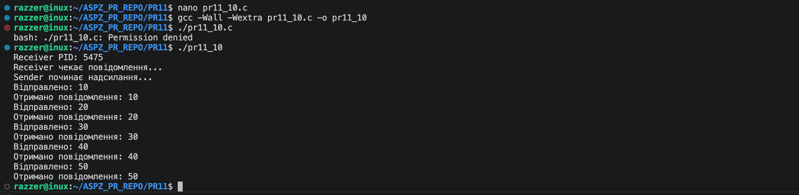

Практична робота №11

Завдання 10

Реалізуйте систему обміну повідомленнями між двома процесами, де кожне повідомлення кодується у sigval.sival_int, і процес отримує повідомлення через sigqueue.

Опис

Програма реалізує міжпроцесну взаємодію (IPC) між двома процесами — відправником і отримувачем — за допомогою сигналів Unix. Дані передаються через функцію sigqueue(), яка дозволяє разом із сигналом передавати ціле число через поле sigval.sival_int. Отримувач приймає сигнал і обробляє передане значення в обробнику сигналу.

Ідея реалізації

Обмін даними між процесами здійснюється через сигнал SIGUSR1, де кожне повідомлення передається як ціле число. Один процес відправляє значення, інший його приймає і одразу обробляє в обробнику сигналу.

Приклад роботи

Збірка та запуск

gcc -Wall -Wextra pr11_10.c -o pr11_10
./pr11_10.c

============================================================================================