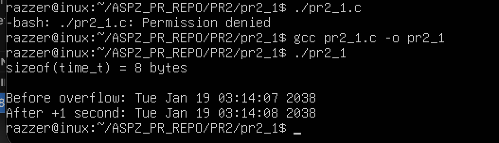
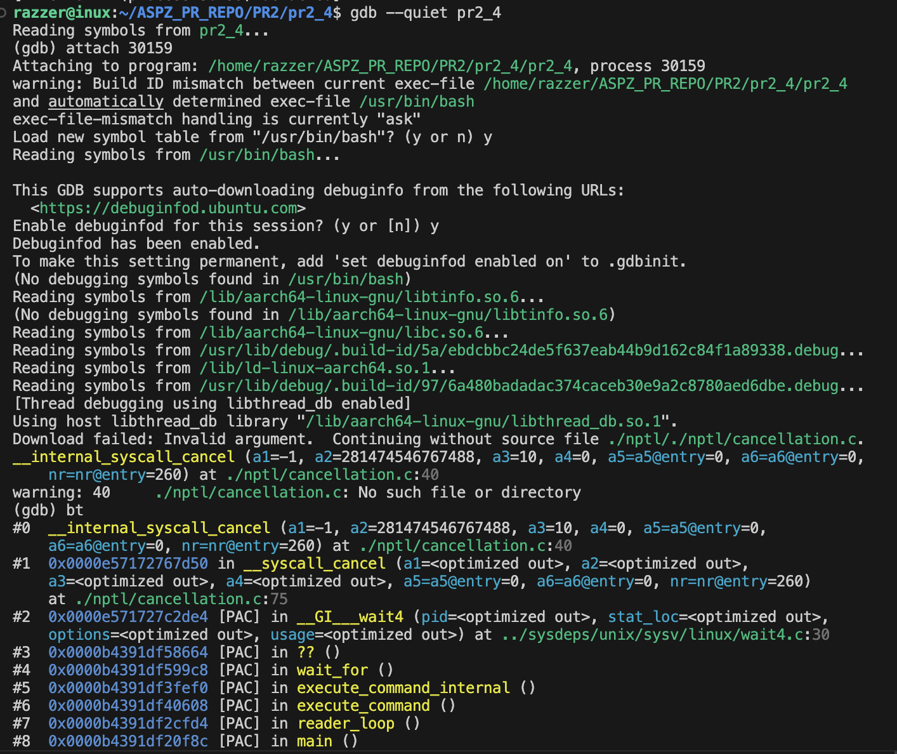

Практична робота №2

Завдання 1

Напишіть програму для визначення моменту, коли time_t
закінчиться.Дослідіть, які зміни відбуваються в залежності від 32- та
64-бітної архітектури. Дослідіть сегменти виконуваного файлу.

Опис

Ця програма реалізована на мові C. Вона автоматично визначає розрядність системи.

Ідея реалізації

Програма визначає розрядність типу time_t і обчислює його максимальне значення у секундах. Для цього використовується sizeof(time_t) та бітові операції. Результат показує, скільки секунд можна зберегти у time_t, що дозволяє оцінити «кінець часу» для системи (на 32-бітній – приблизно 19 січня 2038 року, на 64-бітній – значно більше).

Приклад роботи

Збірка та запуск

gcc pr2_1.c -o pr2_1
./pr2_1

============================================================================================

Завдання 2

Розгляньте сегменти у виконуваному файлі.
1. Скомпілюйте програму &quot;hello world&quot;, запустіть ls -l для
    виконуваного файлу, щоб отримати його загальний розмір, і
    запустіть size, щоб отримати розміри сегментів всередині нього.
2. Додайте оголошення глобального масиву із 1000 int,
    перекомпілюйте й повторіть вимірювання. Зверніть увагу на
    відмінності.
3. Тепер додайте початкове значення в оголошення масиву
    (пам’ятайте, що C не змушує вас вказувати значення для кожного
    елемента масиву в ініціалізаторі). Це перемістить масив із сегмента

    BSS у сегмент даних. Повторіть вимірювання. Зверніть увагу на
    різницю.
4. Тепер додайте оголошення великого масиву в локальну функцію.
    Оголосіть другий великий локальний масив з ініціалізатором.
    Повторіть вимірювання. Дані розташовуються всередині функцій,
    залишаючись у виконуваному файлі? Яка різниця, якщо масив
    ініціалізований чи ні?
5. Які зміни відбуваються з розмірами файлів і сегментів, якщо ви
    компілюєте для налагодження? Для максимальної оптимізації?
    Проаналізуйте результати, щоб переконатися, що:
    ● сегмент даних зберігається у виконуваному файлі;
    ● сегмент BSS не зберігається у виконуваному файлі (за винятком
    примітки щодо його вимог до розміру часу виконання);
    ● текстовий сегмент більшою мірою піддається перевіркам
    оптимізації;
    ● на розмір файлу a.out впливає компіляція для налагодження, але не
    сегменти.

Опис

Ця програма реалізована на мові C. Вона розроблена для дослідження сегментів в linux.

Приклад роботи

Пункт 1
.png)

Пункт 2
.png)

Пункт 3
.png)

Пункт 4
.png)

Пункт 5
.png)

Висновки до завдання

Сегмент data зберігає ініціалізовані глобальні змінні і присутній у виконуваному файлі, тоді як сегмент BSS містить неініціалізовані глобальні змінні і у файлі не зберігається. Локальні змінні та масиви функцій розташовуються у стеку і не впливають на розмір сегментів. Текстовий сегмент містить код і піддається оптимізації, а компіляція з налагодженням збільшує розмір файлу, тоді як оптимізація його зменшує, при цьому розміри сегментів змінюються мінімально.

Збірка та запуск
gcc pr2_2.c -o pr2_2
ls -l pr2_2
size pr2_2

============================================================================================

Завдання 3

Скомпілюйте й запустіть тестову програму, щоб визначити приблизне
розташування стека у вашій системі:
#include &lt;stdio.h&gt;
int main() {
int i;
printf(&quot;The stack top is near %p\n&quot;, &amp;i);
return 0;
}
Знайдіть розташування сегментів даних і тексту, а також купи всередині
сегмента даних, оголосіть змінні, які будуть поміщені в ці сегменти, і
виведіть їхні адреси.
Збільшіть розмір стека, викликавши функцію й оголосивши кілька
великих локальних масивів. Яка зараз адреса вершини стека?

Примітка: стек може розташовуватися за різними адресами на різних
архітектурах та різних ОС. Хоча ми говоримо про вершину стека, на
більшості процесорів

Опис

Ця програма реалізована на мові C. Вона розроблена для дослідження сегментів і стека в linux.

Приклад роботи

Висновки до завдання

Верхівка стеку знаходиться за високими адресами 0xfff…, що відповідає верхній частині віртуального адресного простору. Сегменти тексту і даних розташовані значно нижче, близько 0xbd9…. При виклику функції з великим локальним масивом адреса вершини стеку зменшується, оскільки стек росте вниз.

Збірка та запуск

gcc pr2_3.c -o pr2_3
./pr2_3

============================================================================================

Завдання 4

Ваше завдання – дослідити стек процесу або пригадати, як це робиться. Ви
можете:
● Автоматично за допомогою утиліти gstack.
● Вручну за допомогою налагоджувача GDB.
Користувачі Ubuntu можуть зіткнутися з проблемою: на момент написання
(Ubuntu 18.04) gstack, схоже, не був доступний (альтернативою може бути
pstack). Якщо gstack не працює, використовуйте другий метод – через
GDB, як показано нижче.
Спочатку подивіться на стек за допомогою gstack(1). Нижче наведений
приклад стека bash (аргументом команди є PID процесу):
$ gstack 14654
#0 0x00007f359ec7ee7a in waitpid () from /lib64/libc.so.6
#1 0x000056474b4b41d9 in waitchild.isra ()
#2 0x000056474b4b595d in wait_for ()
#3 0x000056474b4a5033 in execute_command_internal ()
#4 0x000056474b4a5c22 in execute_command ()
#5 0x000056474b48f252 in reader_loop ()
#6 0x000056474b48dd32 in main ()
$
Розбір стека:
● Номер кадру стека відображається ліворуч перед символом #.
● Кадр #0 – це найнижчий кадр. Читайте стек знизу вверх (тобто від
main() – кадр #6 – до waitpid() – кадр #0).
● Якщо процес багатопотоковий, gstack покаже стек кожного потоку
окремо.
Аналіз стека в режимі користувача через GDB

Щоб переглянути стек процесу вручну, використовуйте GDB,
приєднавшись до процесу.
Нижче наведена невелика тестова програма на C, що виконує кілька
вкладених викликів функцій. Граф викликів виглядає так:
main() --&gt; foo() --&gt; bar() --&gt; bar_is_now_closed() --&gt; pause()
Системний виклик pause() – це приклад блокуючого виклику. Він
переводить викликаючий процес у сплячий режим, очікуючи (або
блокуючи) сигнал. У цьому випадку процес блокується, поки не отримає
будь-який сигнал.
#include &lt;stdio.h&gt;
#include &lt;stdlib.h&gt;
#include &lt;unistd.h&gt;
#include &lt;sys/types.h&gt;
#define MSG &quot;In function %20s; &amp;localvar = %p\n&quot;
static void bar_is_now_closed(void) {
int localvar = 5;
printf(MSG, __FUNCTION__, &amp;localvar);
printf(&quot;\n Now blocking on pause()...\n&quot;);
pause();
}
static void bar(void) {
int localvar = 5;
printf(MSG, __FUNCTION__, &amp;localvar);
bar_is_now_closed();
}
static void foo(void) {
int localvar = 5;
printf(MSG, __FUNCTION__, &amp;localvar);
bar();
}
int main(int argc, char **argv) {
int localvar = 5;
printf(MSG, __FUNCTION__, &amp;localvar);
foo();
exit(EXIT_SUCCESS);
}

Тепер відкрийте GDB
У ньому підключіться (attach) до процесу (в наведеному прикладі PID =
24957) і дослідіть стек за допомогою команди backtrace (bt):
$ gdb --quiet
(gdb) attach 24957
Attaching to process 24957
Reading symbols from &lt;...&gt;/hspl/unit2/stacker...done.
Reading symbols from /lib64/libc.so.6...Reading symbols from
/usr/lib/debug/usr/lib64/libc-2.26.so.debug...done.
done.
Reading symbols from /lib64/ld-linux-x86-64.so.2...Reading symbols
...
(gdb) bt
...
Примітка: В Ubuntu, через питання безпеки, GDB не дозволяє
підключатися до довільного процесу. Це можна обійти, запустивши GDB
від імені користувача root.

Аналіз того ж процесу через gstack
$ gstack 24957
...

gstack — це, по суті, оболонковий скрипт (wrapper shell script), який
неінтерактивно викликає GDB і запускає команду backtrace, яку ви
щойно використали.
Завдання: Ознайомтеся з виводом gstack і порівняйте його з GDB.

Опис

Ця програма реалізована на мові C. Вона розроблена для дослідження стека в linux.

Приклад роботи

Збірка та запуск

gcc -g -O0 pr2_4.c -o pr2_4
./pr2_4
gdb --quiet pr2_4
(gdb) attach <PID>
(gdb) bt

============================================================================================

Завдання 5

Відомо, що при виклику процедур і поверненні з них процесор
використовує стек.Чи можна в такій схемі обійтися без лічильника команд
(IP), використовуючи замість нього вершину стека? Обґрунтуйте свою
відповідь та наведіть приклади.

Відповідь

Ні, обійтися без лічильника команд (IP) неможливо. Лічильник команд вказує процесору, 
яку інструкцію виконувати наступною. Стек при виклику функцій використовується лише 
для збереження адреси повернення та локальних даних. Стек не містить повної інформації 
про послідовність команд у програмі, тому без IP процесор 
не зможе виконувати інструкції всередині функцій та після їх повернення.

============================================================================================

Завдання 6

Аналізуйте поведінку динамічних бібліотек під час завантаження.

Відповідь

Динамічні бібліотеки (.so) завантажуються під час виконання програми,
а завантажувач підключає їх у пам’ять процесу та виправляє адреси функцій і змінних.
Код бібліотеки розташовується у .text, дані – у .data або .bss, а функції можуть бути 
зв’язані лише при першому виклику. Це зменшує розмір файлу, економить пам’ять 
і дозволяє використовувати 
різні версії бібліотек без перекомпіляції.

