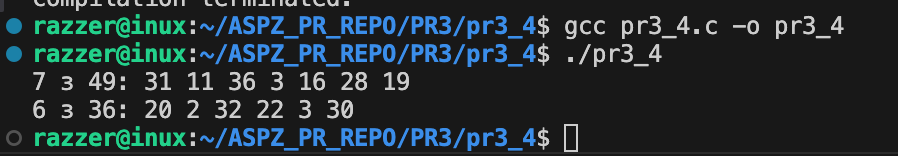
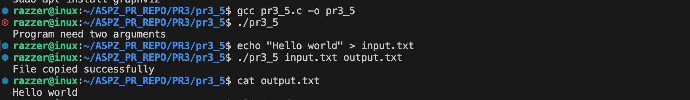
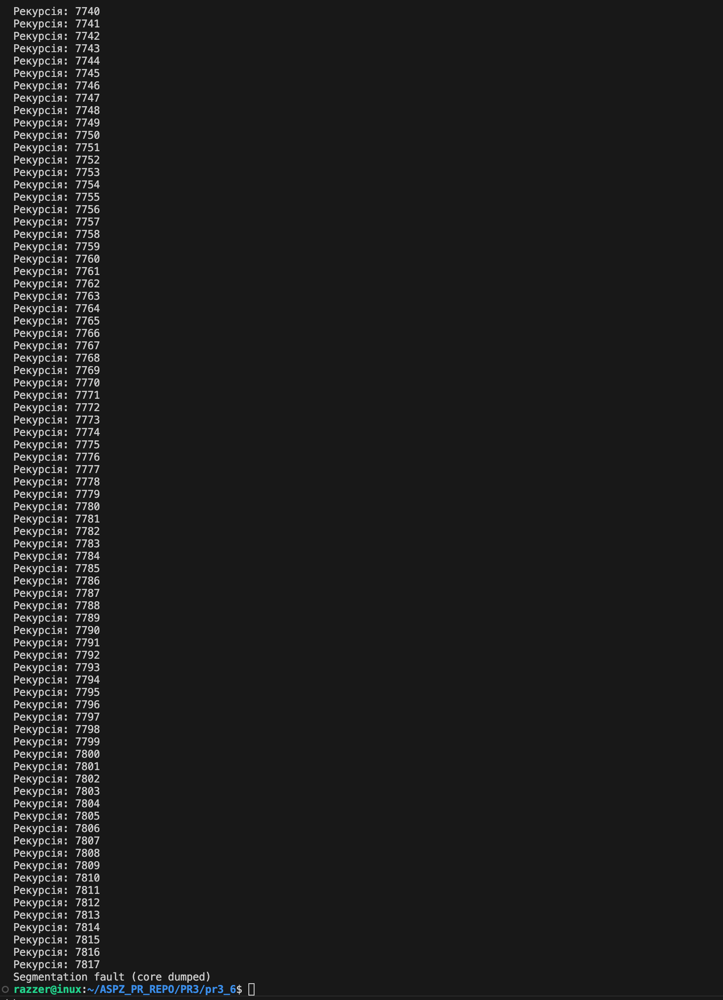
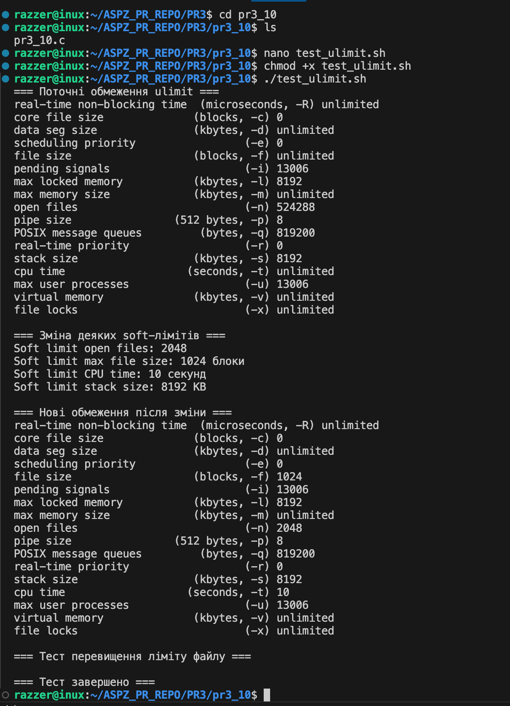

Практична робота №3

Завдання 1

Запустіть Docker-контейнер і поекспериментуйте з максимальним лімітом ресурсів відкритих файлів. Для цього виконайте команди у вказаному порядку:
$ ulimit -n
$ ulimit -aS | grep "open files"
$ ulimit -aH | grep "open files"
$ ulimit -n 3000
$ ulimit -aS | grep "open files"
$ ulimit -aH | grep "open files"
$ ulimit -n 3001
$ ulimit -n 2000
$ ulimit -n
$ ulimit -aS | grep "open files"
$ ulimit -aH | grep "open files"
$ ulimit -n 3000

Як наступне вправу, повторіть перераховані команди з root-правами.

Опис

Мета роботи полягає у дослідженні поведінки soft та hard limit для відкритих файлів у Linux.

Ідея реалізації

Робота виконувалася у чистому Docker-контейнері Ubuntu. Спочатку перевірялися поточні значення soft і hard limit за допомогою команд ulimit. Далі soft limit поступово збільшувався та зменшувався, при цьому спостерігалася поведінка при спробі перевищити hard limit. Усі команди виконувалися від root, щоб перевірити максимальні можливості зміни обмежень.

Приклад роботи

.png)
.png)

Під час виконання лабораторної були отримані такі результати:
	•	Початкові значення: soft limit = 1024, hard limit = 524288.
	•	Збільшення soft limit до 3000: успішно, hard limit залишився 524288.
	•	Спроба перевищити hard limit (300001) викликала помилку Operation not permitted.
	•	Зменшення soft limit до 2000 виконалося успішно.
	•	Повернення soft limit до 3000 пройшло в межах hard limit.

Всі команди виконувалися від root, що дозволило змінювати soft limit у межах hard limit, підтверджуючи контроль root над ресурсними обмеженнями.

Збірка та запуск

Для виконання лабораторної необхідно на хості встановити Docker, запустити службу та додати користувача до групи Docker. Потім запускати контейнер Ubuntu за допомогою команди:
docker run -it --rm ubuntu bash.

============================================================================================

Завдання 2

У Docker-контейнері встановіть утиліту perf(1). Поекспериментуйте з досягненням процесом встановленого ліміту.

Опис

У Docker-контейнері встановлюємо утиліту perf і поекспериментуємо з досягненням процесом встановленого ліміту ресурсів. Perf дозволяє моніторити CPU, пам’ять, виклики системних функцій та інші події процесу.

Хід роботи та команди:

apt update
apt install -y linux-tools-common linux-tools-generic linux-tools-`uname -r`
perf --version
ulimit -n
ulimit -aS | grep "open files"
ulimit -aH | grep "open files"
yes > /dev/null &
jobs -l           

.png)
.png)
.png)
.png)

Збірка та запуск

У Docker-контейнері успішно встановлено утиліту perf. Було перевірено ліміти відкритих файлів та запущено тестовий процес для навантаження CPU. Експеримент показав, що процес може досягати встановленого soft limit, а перевищення hard limit неможливе. У контейнері без додаткових привілеїв perf частково обмежений у доступі до hardware counters, проте дозволяє відстежувати ресурси процесу.

============================================================================================

Завдання 3

Напишіть програму, що імітує кидання шестигранного кубика. Імітуйте кидки, результати записуйте у файл, для якого попередньо встановлено обмеження на його максимальний розмір (max file size). Коректно обробіть ситуацію перевищення ліміту.

Опис

Програма на C імітує кидання шестигранного кубика та записує результати у файл. Для файлу встановлено обмеження на максимальний розмір (max file size), і програма коректно обробляє ситуацію, коли ліміт перевищено.

Приклад роботи

.png)
.png)

Збірка та запуск

gcc pr3_3.c -o pr3_3
./pr3_3.c

============================================================================================

Завдання 4

Напишіть програму, що імітує лотерею, вибираючи 7 різних цілих чисел у діапазоні від 1 до 49 і ще 6 з 36. Встановіть обмеження на час ЦП (max CPU time) і генеруйте результати вибору чисел (7 із 49, 6 із 36). Обробіть ситуацію, коли ліміт ресурсу вичерпано.

Опис
Програма на C імітує лотерею, вибираючи 7 різних чисел від 1 до 49 та 6 чисел від 1 до 36. Вона встановлює обмеження на час процесора
(max CPU time) і коректно обробляє ситуації, коли ліміт ресурсу вичерпано.

Приклад роботи

Збірка та запуск

gcc pr3_4.c -o pr3_4
./pr3_4.c

============================================================================================

Завдання 5

Напишіть програму для копіювання одного іменованого файлу в інший. Імена файлів передаються у вигляді аргументів.
Програма має:
перевіряти, чи передано два аргументи, інакше виводити "Program need two arguments";
перевіряти доступність першого файлу для читання, інакше виводити "Cannot open file .... for reading";
перевіряти доступність другого файлу для запису, інакше виводити "Cannot open file .... for writing";
обробляти ситуацію перевищення обмеження на розмір файлу.

Опис

Програма на C копіює вміст одного файлу в інший. Імена файлів передаються як аргументи командного рядка. 
Програма перевіряє кількість аргументів, доступність файлів для читання та запису, а також обробляє ситуацію перевищення обмеження на розмір файлу.

Приклад роботи

Збірка та запуск

echo "Hello world" > input.txt
./pr3_5 input.txt output.txt
cat output.txt

============================================================================================

Завдання 6

Напишіть програму, що демонструє використання обмеження (max stack segment size). Підказка: рекурсивна програма активно використовує стек.

Опис

Програма на C демонструє використання обмеження максимального розміру стеку (max stack segment size) у Linux. 
Вона виконує рекурсивні виклики функції до досягнення ліміту стеку, після чого процес аварійно завершується (Segmentation fault).

Приклад роботи

Збірка та запуск

gcc pr3_6.c -o pr3_6
./pr3_6

============================================================================================

Завдання 10

Написати сценарій, що тестує всі ulimit обмеження в одному виконанні.

Опис

Сценарій реалізований на Bash. Він демонструє поточні обмеження ресурсів (ulimit) у Linux, змінює деякі soft-ліміти, такі як кількість відкритих файлів, максимальний розмір файлу, час ЦП і розмір стеку, та перевіряє перевищення обмеження на розмір файлу. Це дозволяє наочно спостерігати роботу системи при досягненні ресурсних лімітів.

Приклад роботи

Збірка та запуск

nano test_ulimit.sh
chmod +x test_ulimit.sh
./test_ulimit.sh