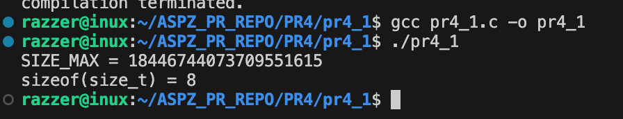
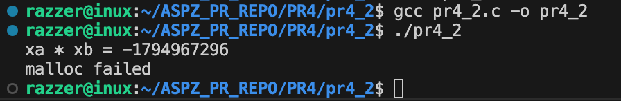
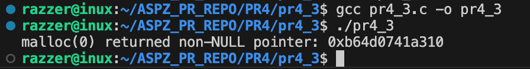
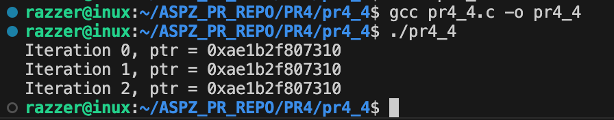
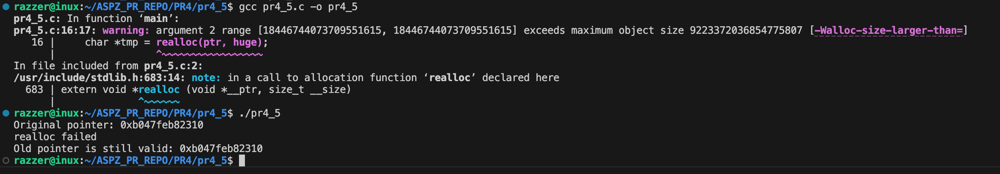
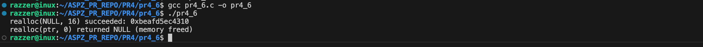
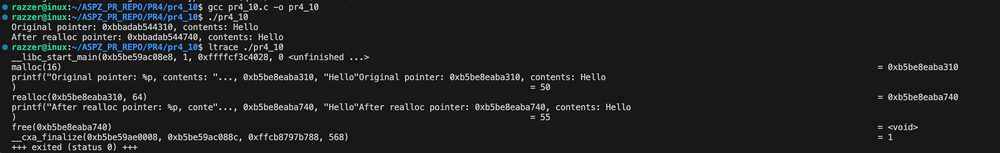

Практична робота №4

Завдання 1

Скільки пам’яті може виділити malloc(3) за один виклик?
Параметр malloc(3) є цілим числом типу даних size_t, тому логічно максимальне число, яке можна передати як параметр malloc(3),
— це максимальне значення size_t на платформі (sizeof(size_t)). У 64-бітній Linux size_t становить 8 байтів, тобто 8 * 8 = 64 біти.
Відповідно, максимальний обсяг пам’яті, який може бути виділений за один виклик malloc(3), дорівнює 2^64. Спробуйте запустити код на x86_64 та x86.
Чому теоретично максимальний обсяг складає 8 ексабайт, а не 16?

Опис

У роботі визначається максимальний обсяг пам’яті, який може бути виділений функцією malloc(3), залежно від розрядності системи та типу size_t.
 Розглядаються як теоретична межа, так і реальні обмеження архітектури.

Ідея реалізації

Для визначення максимального обсягу пам’яті використовується тип size_t. У програмі обчислюється його розмір за допомогою sizeof(size_t) та виводиться максимальне значення (SIZE_MAX).
Отримані результати аналізуються з урахуванням розрядності системи (x86 або x86_64) та обмежень адресного простору процесу.

Приклад роботи

Теоретично malloc може прийняти до 2^64 - 1 байтів.
Через обмеження архітектури x86_64 реально використовується значно менший адресний простір.
У Linux процесу доступно приблизно 128 ТБ.
Тому 16 ЕБ є математичною межею, а 8 ЕБ — архітектурною.

Збірка та запуск

gcc pr4_1.c -o pr4_1
./pr4_1.c

============================================================================================

Завдання 2

Що станеться, якщо передати malloc(3) від’ємний аргумент? Напишіть тестовий випадок, який обчислює кількість виділених байтів за формулою num = xa * xb.
Що буде, якщо num оголошене як цілочисельна змінна зі знаком, а результат множення призведе до переповнення?
Як себе поведе malloc(3)? Запустіть програму на x86_64 і x86.

Опис

У завданні досліджується поведінка malloc(3) при передачі від’ємного аргументу або при переповненні цілочисельної змінної.
Розглядається перетворення числа у size_t, можливе переповнення та наслідки для виділення пам’яті на x86 і x86_64.

Ідея реалізації

Оголошується змінна для обчислення кількості байтів (num = xa * xb). Якщо змінна знакова і відбувається переповнення, результат передається в malloc(),
де відбувається перетворення у size_t. Програма перевіряє, чи виділено пам’ять (NULL або валідний вказівник) і демонструє поведінку на різних архітектурах (x86 та x86_64).

Приклад роботи

Збірка та запуск

gcc pr4_2.c -o pr4_2
./pr4_2.c

============================================================================================

Завдання 3

Що станеться, якщо використати malloc(0)? Напишіть тестовий випадок, у якому malloc(3) повертає NULL або вказівник, що не є NULL, і який можна передати у free().
Відкомпілюйте та запустіть через ltrace. Поясніть поведінку програми.

Опис

У завданні досліджується поведінка malloc(0). Пояснюється, що функція може повернути NULL або не NULL вказівник, який можна безпечно передати у free().
Програма демонструє обидва випадки та показує, що виділення нульового розміру пам’яті безпечне і не призводить до помилок.

Ідея реалізації

Програма викликає malloc(0) і перевіряє результат: якщо повернувся NULL або валідний вказівник, його виводять на екран.
Потім виконується free() для безпечного звільнення пам’яті. Так демонструється поведінка malloc(0) на різних системах.

Приклад роботи

Збірка та запуск

gcc pr4_3.c -o pr4_3
./pr4_3.c

============================================================================================

Завдання 4

Чи є помилки у такому коді?
void *ptr = NULL;
while (<some-condition-is-true>) {
    if (!ptr)
        ptr = malloc(n);
    [... <використання 'ptr'> ...]
    free(ptr);
}

Напишіть тестовий випадок, який продемонструє проблему та правильний варіант коду.

Опис

У завданні аналізується коректність використання динамічної пам’яті в циклі. Після виклику free() вказівник не обнуляється, що призводить до появи висячого вказівника (dangling pointer) та використання вже звільненої пам’яті.
Тестовий приклад демонструє цю проблему та показує правильний спосіб її усунення шляхом обнулення вказівника або зміни структури коду.

Ідея реалізації

Створюється цикл, у якому пам’ять виділяється через malloc() лише якщо вказівник дорівнює NULL. Після використання викликається free(),
але в помилковому варіанті вказівник не обнуляється, що призводить до використання звільненої пам’яті. Далі реалізується правильний варіант, у якому після free() виконується ptr = NULL,
або виділення пам’яті переноситься всередину циклу, що усуває проблему висячого вказівника.

Приклад роботи

Збірка та запуск

gcc pr4_4.c -o pr4_4
./pr4_4.c

============================================================================================

Завдання 5

Що станеться, якщо realloc(3) не зможе виділити пам’ять? Напишіть тестовий випадок, що демонструє цей сценарій.

Опис

У завданні досліджується поведінка realloc(3) у випадку, коли виділення пам’яті неможливе. Програма намагається збільшити розмір блоку до дуже великого значення, що призводить до повернення NULL. При цьому перевіряється, що початковий блок пам’яті залишається валідним і повинен бути звільнений вручну, що демонструє правильну обробку помилки realloc().

Ідея реалізації

Програма виділяє початковий блок пам’яті через malloc(). Потім виконується realloc() з дуже великим розміром, що неможливо виділити.
Результат зберігається у тимчасовій змінній: якщо realloc() повертає NULL, старий блок залишається валідним і звільняється через free().
Це дозволяє безпечно обробити помилку виділення пам’яті та уникнути витоків.

Приклад роботи

Збірка та запуск

gcc pr4_5.c -o pr4_5
./pr4_5.c

============================================================================================

Завдання 6

Якщо realloc(3) викликати з NULL або розміром 0, що станеться? Напишіть тестовий випадок.

Опис

У завданні досліджується поведінка realloc(3) при виклику з NULL або нульовим розміром. Якщо вказівник NULL, realloc() поводиться як malloc()
і виділяє новий блок пам’яті. Якщо розмір дорівнює 0, realloc() звільняє попередній блок і може повернути NULL або валідний вказівник, який безпечно можна передати у free().

Ідея реалізації

Програма виконує два виклики realloc(). Перший – з NULL, щоб продемонструвати виділення нового блоку пам’яті (еквівалент malloc()).
Другий – з ненульовим вказівником і розміром 0, щоб показати, що попередній блок звільняється, а результат може бути NULL або валідним вказівником, який безпечно передати у free().

Приклад роботи

Збірка та запуск

gcc pr4_6.c -o pr4_6
./pr4_6.c

============================================================================================

Завдання 7

Перепишіть наступний код, використовуючи reallocarray(3):
struct sbar *ptr, *newptr;
ptr = calloc(1000, sizeof(struct sbar));
newptr = realloc(ptr, 500*sizeof(struct sbar));

Порівняйте результати виконання з використанням ltrace.

Опис

У завданні переписується код із realloc() на reallocarray(3) для безпечного зміни розміру масиву структур. reallocarray() перевіряє переповнення при множенні кількості елементів на розмір, що запобігає помилкам integer overflow.
Програма демонструє виділення пам’яті через calloc(), зміну розміру через reallocarray() та безпечне звільнення пам’яті через free().

Ідея реалізації

Програма спочатку виділяє блок пам’яті для 1000 структур за допомогою calloc(). Потім розмір блоку змінюється на 500 елементів за допомогою reallocarray(),
що виконує безпечне множення і перевірку переповнення. Нарешті, оновлений вказівник використовується у програмі і пам’ять звільняється через free().

Приклад роботи

Збірка та запуск

gcc pr4_7.c -o pr4_7
./pr4_7.c

============================================================================================

Завдання 10

Дослідити поведінку realloc() при розширенні блоку. Виявити випадки копіювання та “розширення на місці”.

Опис

У завданні досліджується поведінка realloc() при розширенні блоку пам’яті. Програма виділяє початковий блок через malloc(), потім намагається збільшити його розмір.
Демонструється два варіанти: розширення на місці (адреса блоку не змінюється) та копіювання в новий блок (адреса змінюється). Використання ltrace дозволяє наочно спостерігати, чи відбулося копіювання чи розширення на місці

Ідея реалізації

Програма виділяє блок пам’яті через malloc(), потім розширює його за допомогою realloc(). Якщо адреса вказівника не змінюється — відбулося розширення на місці,
якщо змінюється — старий блок було скопійовано в новий блок пам’яті. Для наочної демонстрації використовується ltrace, який показує, коли виділяється новий блок і коли відбувається копіювання.

Приклад роботи

Збірка та запуск

gcc pr4_10.c -o pr4_10
./pr4_10.c
