Практична робота №7

Завдання 1

Використайте popen(), щоб передати вивід команди rwho (команда UNIX) до more (команда UNIX) у програмі на C.

Опис

У програмі використано функцію popen() для виконання системної команди ls -l та передачі її виводу до more. Отриманий потік зчитується за допомогою fgets() і виводиться на екран, що демонструє роботу з міжпроцесною взаємодією через pipe у середовищі Linux.

Ідея реалізації

Ідея реалізації полягає у використанні функції popen() для запуску системної команди ls -l та отримання її виводу як потоку даних у програмі на C. Програма відкриває процес виконання команди та зчитує її результат за допомогою fgets(), після чого вивід передається далі на обробку або відображення.

Таким чином реалізується принцип передачі даних між процесами через pipe (|), подібно до роботи в командному рядку Linux, де вивід однієї команди передається як вхід для іншої (у даному випадку до more). Це дозволяє продемонструвати механізм міжпроцесної взаємодії та роботу з потоками введення/виведення в системному програмуванні.

Приклад роботи

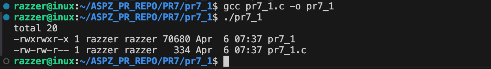

Збірка та запуск

gcc -g pr7_1.c -o pr7_1
./pr7_1

============================================================================================

Завдання 2

Напишіть програму мовою C, яка імітує команду ls -l в UNIX — виводить список усіх файлів у поточному каталозі та перелічує права доступу тощо.
Варіант вирішення, що просто виконує ls -l із вашої програми, — не підходить.

Опис

Розробити програму мовою C, яка імітує команду ls -l у UNIX/Linux: виводить список файлів у поточному каталозі з відображенням їх прав доступу, розміру та назви, використовуючи системні виклики (opendir, readdir, stat) без виклику самої команди ls.

Ідея реалізації

Програма відкриває поточний каталог за допомогою opendir() і читає його вміст через readdir(). Для кожного елемента отримується інформація про файл через stat(). Далі обробляється поле st_mode, щоб визначити права доступу та тип файлу, і ці дані виводяться у вигляді, подібному до команди ls -l, разом з розміром файлу та його назвою.

Приклад роботи

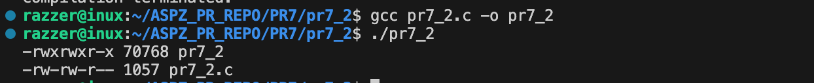

Збірка та запуск

gcc -g pr7_2.c -o pr7_2
./pr7_2

============================================================================================

Завдання 3

Напишіть програму, яка друкує рядки з файлу, що містять слово, передане як аргумент програми (проста версія утиліти grep в UNIX).

Опис

Програма реалізує просту версію команди grep в UNIX. Вона зчитує ім’я слова та файл із аргументів командного рядка, після чого пострічково читає файл і виводить лише ті рядки, які містять задане слово.

Ідея реалізації

Програма зчитує слово та ім’я файлу з аргументів командного рядка, відкриває файл і пострічково обробляє його вміст за допомогою fgets. Для кожного рядка перевіряється наявність заданого слова за допомогою strstr, і якщо слово знайдено — рядок виводиться на екран.

Приклад роботи

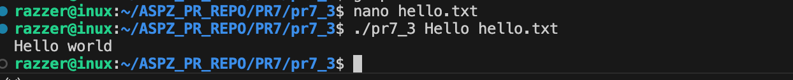

Збірка та запуск

gcc -g pr7_3.c -o pr7_3
./pr7_3

============================================================================================

Завдання 4

Напишіть програму, яка виводить список файлів, заданих у вигляді аргументів, з зупинкою кожні 20 рядків, доки не буде натиснута клавіша (спрощена версія утиліти more в UNIX).

Опис

Програма реалізує спрощену версію утиліти more: вона виводить вміст файлів, переданих як аргументи командного рядка, з паузою кожні 20 рядків, очікуючи натискання клавіші Enter для продовження.

Ідея реалізації

Програма читає файли, передані як аргументи командного рядка, рядок за рядком і виводить їх на екран. Ведеться підрахунок кількості виведених рядків, і після кожних 20 рядків виконання призупиняється, очікуючи натискання клавіші Enter. Після цього вивід продовжується. Також передбачено обробку кількох файлів послідовно.

Приклад роботи

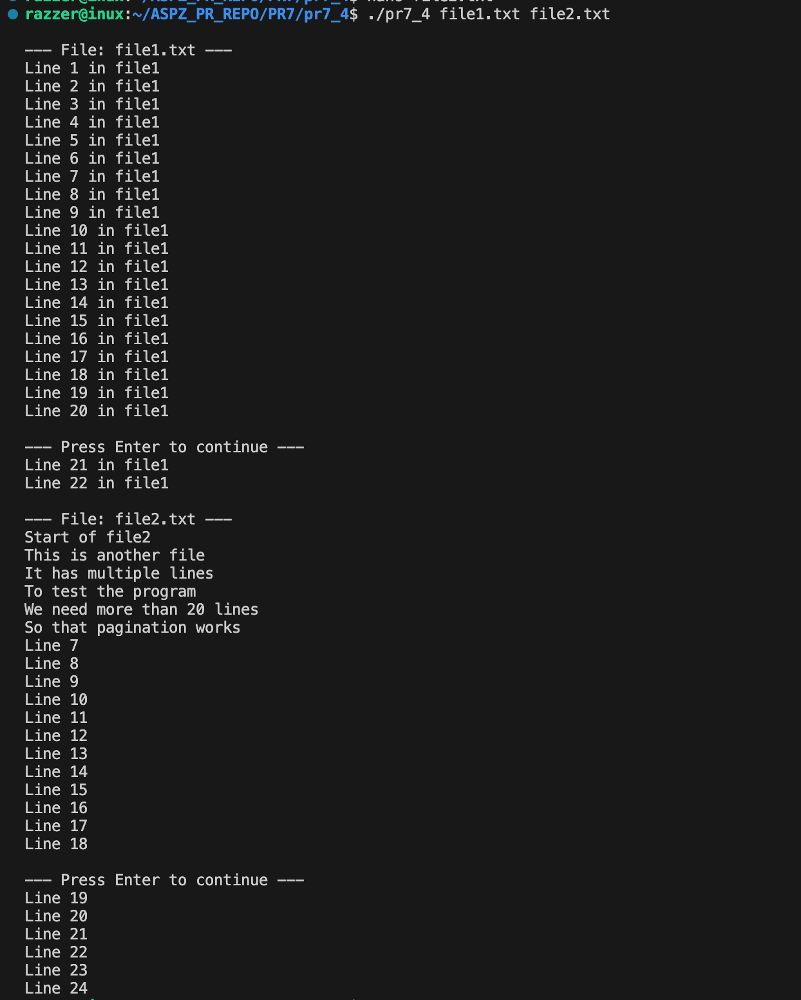

Збірка та запуск

gcc -g pr7_4.c -o pr7_4
./pr7_4

============================================================================================

Завдання 5

Напишіть програму, яка перелічує всі файли в поточному каталозі та всі файли в підкаталогах.

Опис

Програма здійснює рекурсивний обхід поточного каталогу та всіх його підкаталогів. Вона відкриває кожну директорію, читає її вміст і для кожного елемента визначає, чи є він файлом або папкою. У процесі виконання програма виводить список усіх знайдених файлів і директорій у термінал.

Ідея реалізації

Програма використовує рекурсивний підхід: вона відкриває поточний каталог, читає всі його елементи і для кожного перевіряє його тип. Якщо елемент є директорією — програма викликає саму себе для обходу цієї директорії. Якщо це файл — він просто виводиться в термінал. Такий підхід дозволяє послідовно пройти всі рівні вкладеності.

Приклад роботи

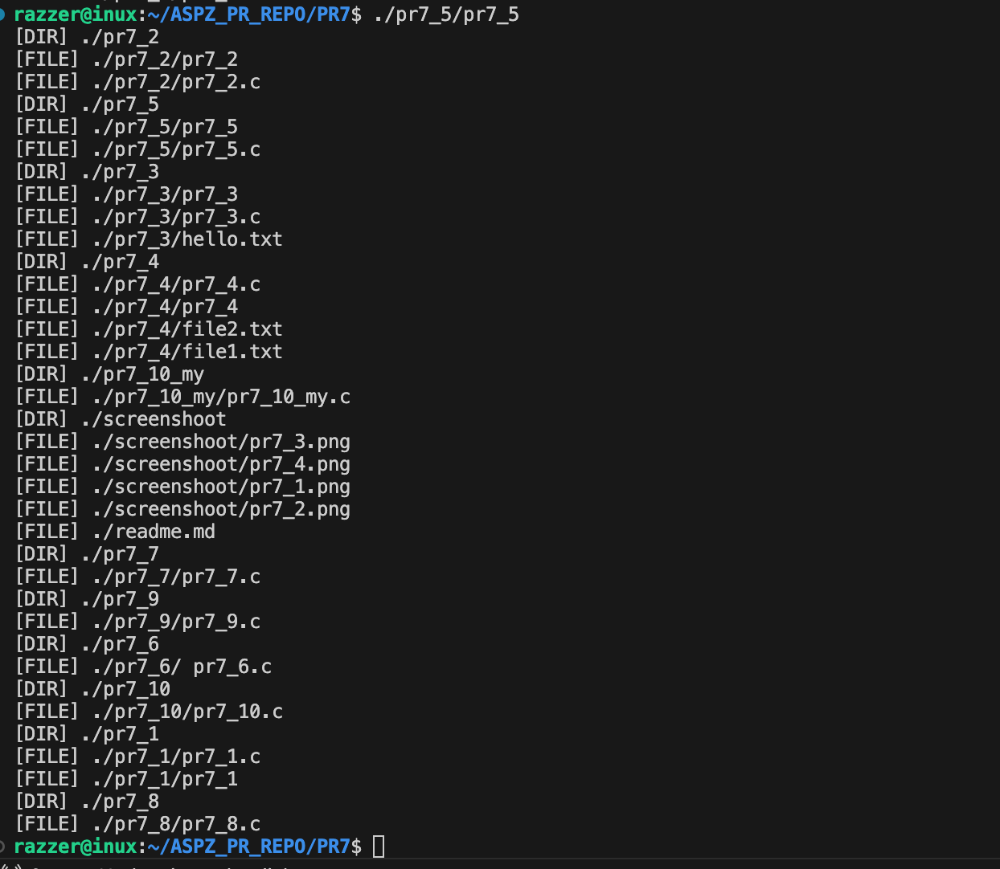

Збірка та запуск

gcc -g pr7_5.c -o pr7_5
./pr7_5

============================================================================================

Завдання 6

Напишіть програму, яка перелічує лише підкаталоги у алфавітному порядку.

Опис

Програма призначена для виведення списку підкаталогів у поточній директорії. Вона переглядає вміст каталогу, визначає, які елементи є директоріями, та формує їх список. Отримані назви підкаталогів сортуються за алфавітом і виводяться у термінал.

Ідея реалізації

Програма відкриває поточний каталог і зчитує всі його елементи. Для кожного елемента визначається його тип за допомогою stat. Якщо елемент є директорією — його ім’я додається до списку. Після обходу всі знайдені підкаталоги сортуються за алфавітом (наприклад, за допомогою qsort) і виводяться на екран.

Приклад роботи

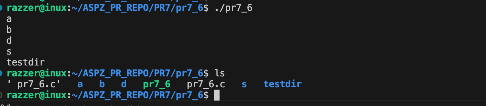

Збірка та запуск

gcc -g pr7_6.c -o pr7_6
./pr7_6

============================================================================================

Завдання 7

Напишіть програму, яка показує користувачу всі його/її вихідні програми на C, а потім в інтерактивному режимі запитує, чи потрібно надати іншим дозвіл на читання (read permission); у разі ствердної відповіді — такий дозвіл повинен бути наданий.

Опис

Програма переглядає всі файли з розширенням .c у поточній директорії та виводить їх назви користувачу. Для кожного знайденого файлу в інтерактивному режимі запитується, чи потрібно надати іншим користувачам право на читання. У разі позитивної відповіді програма змінює права доступу до файлу, додаючи дозвіл на читання для інших за допомогою функції chmod.

Ідея реалізації

Програма відкриває поточний каталог і переглядає всі файли. Вона відбирає лише файли з розширенням .c, після чого для кожного такого файлу в інтерактивному режимі запитує у користувача, чи потрібно надати дозвіл на читання для інших користувачів. У разі позитивної відповіді програма змінює права доступу до файлу за допомогою chmod, додаючи відповідний дозвіл.

Приклад роботи

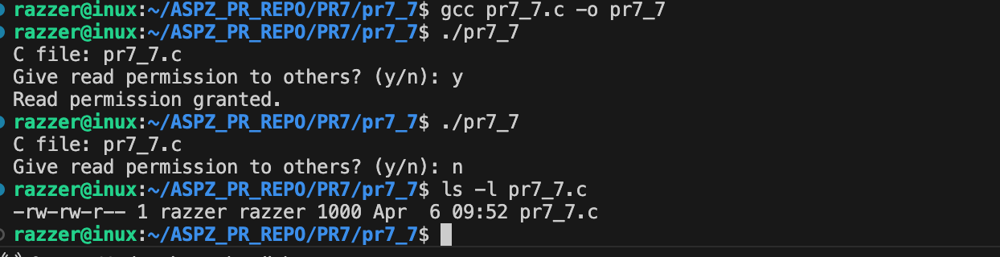

Збірка та запуск

gcc -g pr7_7.c -o pr7_7
./pr7_7
ls -l pr7_7.c

============================================================================================

Завдання 8

Напишіть програму, яка надає користувачу можливість видалити будь-який або всі файли у поточному робочому каталозі. Має з’являтися ім’я файлу з запитом, чи слід його видалити.

Опис

Програма переглядає всі файли у поточному робочому каталозі та по черзі виводить їхні імена користувачу. Для кожного файлу з’являється запит, чи потрібно його видалити. У разі позитивної відповіді файл видаляється за допомогою функції remove, інакше програма переходить до наступного файлу.

Ідея реалізації

Програма відкриває поточний каталог і послідовно переглядає всі його елементи. Для кожного елемента, який є файлом (крім службових . і ..), користувачу в інтерактивному режимі пропонується підтвердити його видалення. Якщо користувач відповідає ствердно, файл видаляється за допомогою функції remove, після чого програма переходить до наступного елемента.

Приклад роботи

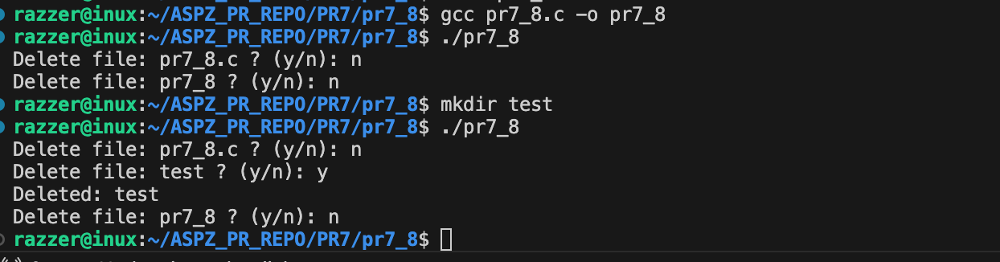

Збірка та запуск

gcc -g pr7_8.c -o pr7_8
./pr7_8

============================================================================================

Завдання 9

Напишіть програму на C, яка вимірює час виконання фрагмента коду в мілісекундах.

Опис

Програма вимірює час виконання заданого фрагмента коду. Для цього фіксується початковий час перед виконанням і кінцевий час після завершення роботи фрагмента. Різниця між цими значеннями обчислюється та переводиться в мілісекунди, після чого результат виводиться на екран.

Ідея реалізації

Програма використовує функцію clock() для фіксації часу до початку виконання фрагмента коду та після його завершення. Після цього обчислюється різниця між отриманими значеннями і переводиться у мілісекунди шляхом ділення на CLOCKS_PER_SEC та множення на 1000. Отримане значення відображає час виконання фрагмента коду.

Приклад роботи

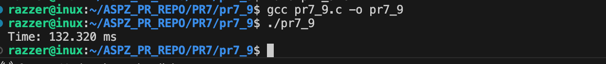

Збірка та запуск

gcc -g pr7_9.c -o pr7_9
./pr7_9

============================================================================================

Завдання 10

Напишіть програму мовою C для створення послідовності випадкових чисел з плаваючою комою у діапазонах:
 (a) від 0.0 до 1.0
 (b) від 0.0 до n, де n — будь-яке дійсне число з плаваючою точкою.
 Початкове значення генератора випадкових чисел має бути встановлене так, щоб гарантувати унікальну послідовність.
Примітка: використання прапорця -Wall під час компіляції є обов’язковим.

Опис

Програма генерує послідовність випадкових чисел з плаваючою комою. Спочатку користувач вводить значення n. Далі за допомогою генератора псевдовипадкових чисел створюються значення у діапазоні від 0.0 до 1.0, а також ці ж значення масштабуються до діапазону від 0.0 до n. Результати виводяться на екран. Для забезпечення унікальності послідовності генератор ініціалізується за допомогою srand(time(NULL)).

Ідея реалізації

Ідея програми полягає у використанні стандартного генератора псевдовипадкових чисел rand() для створення набору випадкових значень і їх подальшого масштабування.
Спочатку програма запитує у користувача число n, яке визначає верхню межу другого діапазону. Далі генератор випадкових чисел ініціалізується функцією srand(time(NULL)), щоб при кожному запуску отримувати різні послідовності.
Після цього:
	1.	Генеруються числа у стандартному діапазоні [0; 1] шляхом ділення rand() на RAND_MAX.
	2.	Ті самі числа масштабуються до діапазону [0; n] множенням на n.

Приклад роботи

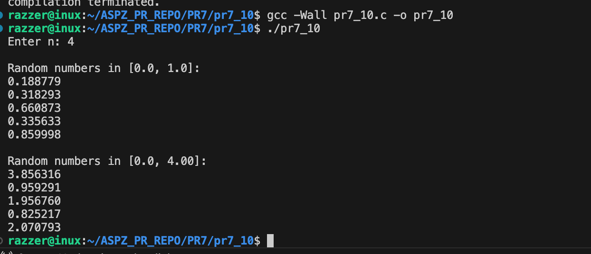

Збірка та запуск

gcc -Wall pr7_10.c -o pr7_10
./pr7_10

============================================================================================

Завдання 10_my

Створіть утиліту, яка виводить таблицю відкритих файлів усіх процесів у системі без доступу до /proc.

Опис

Утиліта призначена для виведення таблиці відкритих файлів усіх процесів у системі. Програма створює новий процес за допомогою fork(), після чого дочірній процес запускає системну утиліту lsof через execlp(). Саме lsof отримує інформацію про відкриті файли всіх процесів від ядра операційної системи та виводить її у вигляді таблиці.
Батьківський процес очікує завершення дочірнього процесу за допомогою waitpid(). Таким чином забезпечується синхронне виконання програми та коректне завершення роботи утиліти.
У програмі не використовується прямий доступ до файлової системи /proc, що відповідає умові завдання. Отримання інформації здійснюється через стандартні механізми взаємодії процесів в операційній системі та зовнішню системну утиліту.

Ідея реалізації

Програма створює дочірній процес за допомогою fork(), у якому запускається системна утиліта lsof через execlp(). Вона виводить таблицю відкритих файлів усіх процесів. Батьківський процес очікує завершення дочірнього за допомогою waitpid().

Приклад роботи

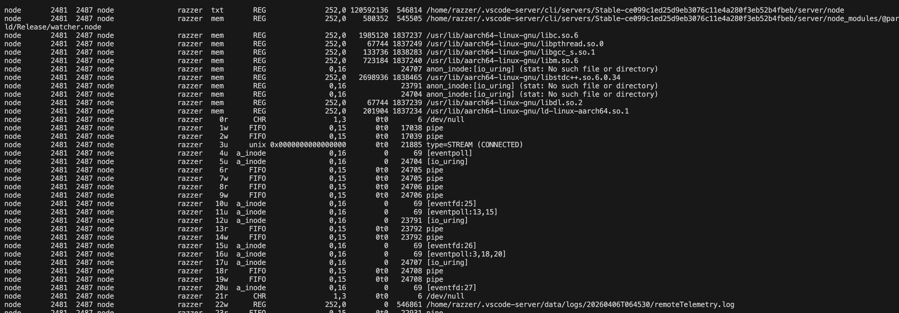

Збірка та запуск

gcc -Wall pr7_10_my.c -o pr7_10_my
./pr7_10_my
