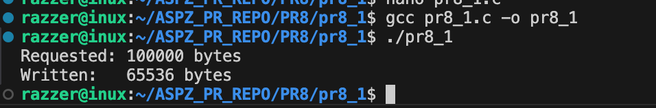
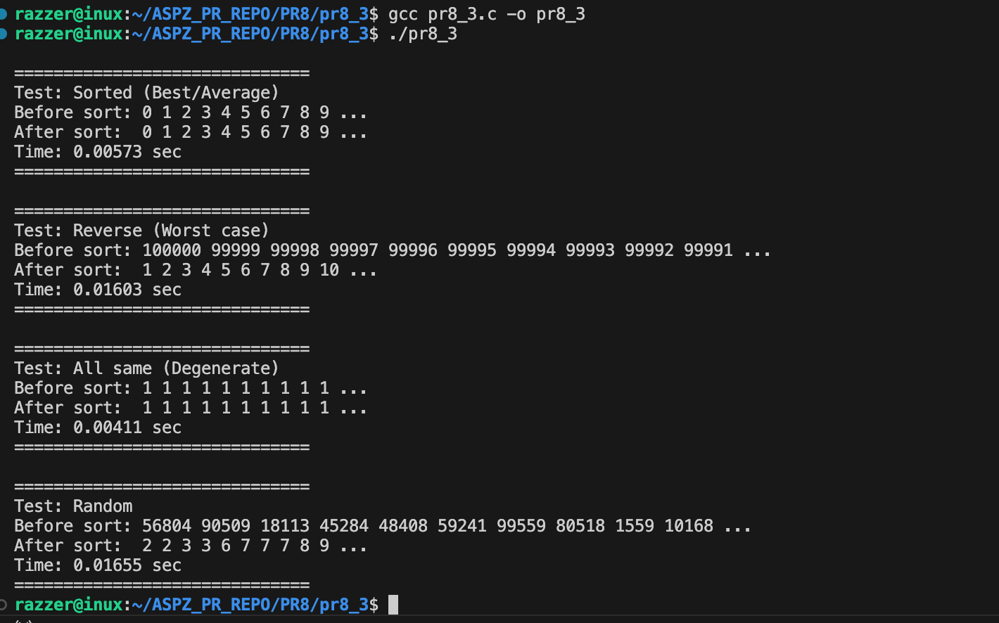
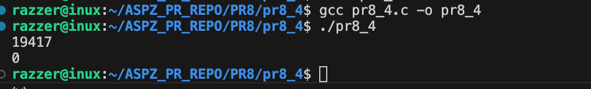
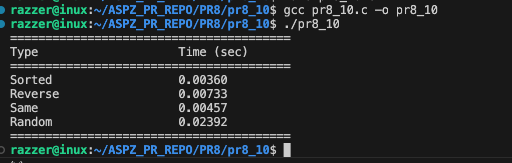

Практична робота №8

Завдання 1

Чи може виклик count = write(fd, buffer, nbytes); повернути в змінній count значення, відмінне від nbytes? Якщо так, то чому? Наведіть робочий приклад програми, яка демонструє вашу відповідь.

Опис

Завдання полягає в перевірці поведінки системного виклику write(), а саме — з’ясувати, чи завжди він записує всі запитані байти, та продемонструвати на прикладі програми ситуацію, коли запис відбувається лише частково.

Ідея реалізації

Створили канал (pipe), встановили для нього неблокуючий режим (O_NONBLOCK), сформували великий буфер даних і виконали запис через write(), після чого порівняли кількість запитаних і реально записаних байтів.

Приклад роботи

Збірка та запуск

gcc -g pr8_1.c -o pr8_1
./pr8_1

============================================================================================

Завдання 2

Є файл, дескриптор якого — fd. Файл містить таку послідовність байтів: 4, 5, 2, 2, 3, 3, 7, 9, 1, 5. У програмі виконується наступна послідовність системних викликів:
lseek(fd, 3, SEEK_SET);
read(fd, &buffer, 4);
де виклик lseek переміщує покажчик на третій байт файлу. Що буде містити буфер після завершення виклику read? Наведіть робочий приклад програми, яка демонструє вашу відповідь.

Опис

Програма створює файл, записує в нього послідовність байтів, переміщує файловий покажчик на 4-й байт за допомогою lseek(), зчитує 4 байти через read() і виводить їх на екран, демонструючи роботу позиційного читання у файлі.

Ідея реалізації

Створити файл, записати в нього задану послідовність байтів, встановити покажчик на потрібну позицію за допомогою lseek(), зчитати необхідну кількість байтів через read() і вивести результат для перевірки.

Приклад роботи

Збірка та запуск

gcc -g pr8_2.c -o pr8_2
./pr8_2

============================================================================================

Завдання 3

Бібліотечна функція qsort призначена для сортування даних будь-якого типу. Для її роботи необхідно підготувати функцію порівняння, яка викликається з qsort кожного разу, коли потрібно порівняти два значення.
Оскільки значення можуть мати будь-який тип, у функцію порівняння передаються два вказівники типу void* на елементи, що порівнюються.
Напишіть програму, яка досліджує, які вхідні дані є найгіршими для алгоритму швидкого сортування. Спробуйте знайти кілька масивів даних, які змушують qsort працювати якнайповільніше. Автоматизуйте процес експериментування так, щоб підбір і аналіз вхідних даних виконувалися самостійно.

Придумайте і реалізуйте набір тестів для перевірки правильності функції qsort.

Опис

У роботі досліджується робота бібліотечної функції qsort, яка використовується для сортування масивів різних типів даних. Реалізовано програму, що автоматично генерує різні типи вхідних даних (впорядковані, у зворотному порядку, однакові значення та випадкові), застосовує до них qsort, вимірює час виконання та перевіряє правильність сортування, що дозволяє визначити найгірші випадки роботи алгоритму швидкого сортування.

Ідея реалізації

Створили набір функцій для генерації різних типів масивів, реалізували функцію порівняння для qsort, виконали сортування для кожного випадку, виміряли час виконання та перевірили правильність відсортованого результату.

Приклад роботи

Збірка та запуск

gcc -g pr8_3.c -o pr8_3
./pr8_3

============================================================================================

Завдання 4

Виконайте наступну програму на мові програмування С:
int main() {
  int pid;
  pid = fork();
  printf("%d\n", pid);
}

Завершіть цю програму. Припускаючи, що виклик fork() був успішним, яким може бути результат виконання цієї програми?

Опис

Програма створює новий процес за допомогою fork(), після чого обидва процеси виконують команду printf. У батьківському процесі виводиться PID дочірнього процесу (значення більше 0), а в дочірньому — 0, тому виводяться два числа у невизначеному порядку.

Ідея реалізації

Створили новий процес за допомогою fork(), після чого в обох процесах вивели значення, яке повертає fork(), щоб показати різницю між батьківським і дочірнім процесами.

Приклад роботи

Збірка та запуск

gcc -g pr8_4.c -o pr8_4
./pr8_4

============================================================================================

Завдання 10

Побудуйте таблицю з часами виконання qsort() для різних схем вхідних даних і поясніть сплески в часі.

Опис

Програма формує різні типи масивів (відсортований, зворотний, однаковий та випадковий), сортує їх за допомогою qsort(), вимірює час виконання для кожного випадку та виводить результати у вигляді таблиці для аналізу продуктивності алгоритму.

Ідея реалізації

Створили функції для генерації різних типів масивів (відсортований, зворотний, однаковий, випадковий), виконали сортування за допомогою qsort(), виміряли час виконання для кожного випадку та вивели результати у вигляді таблиці для порівняння продуктивності алгоритму.

Приклад роботи

Збірка та запуск

gcc pr8_10.c -o pr8_10
./pr8_10
