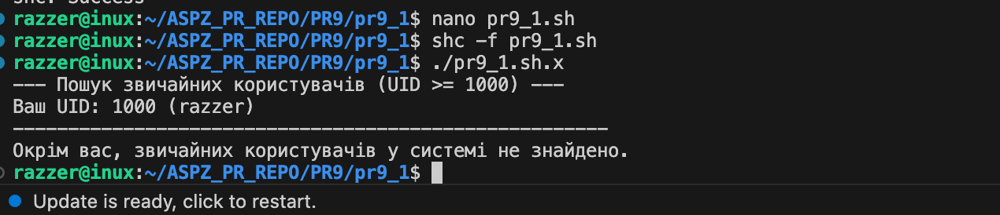
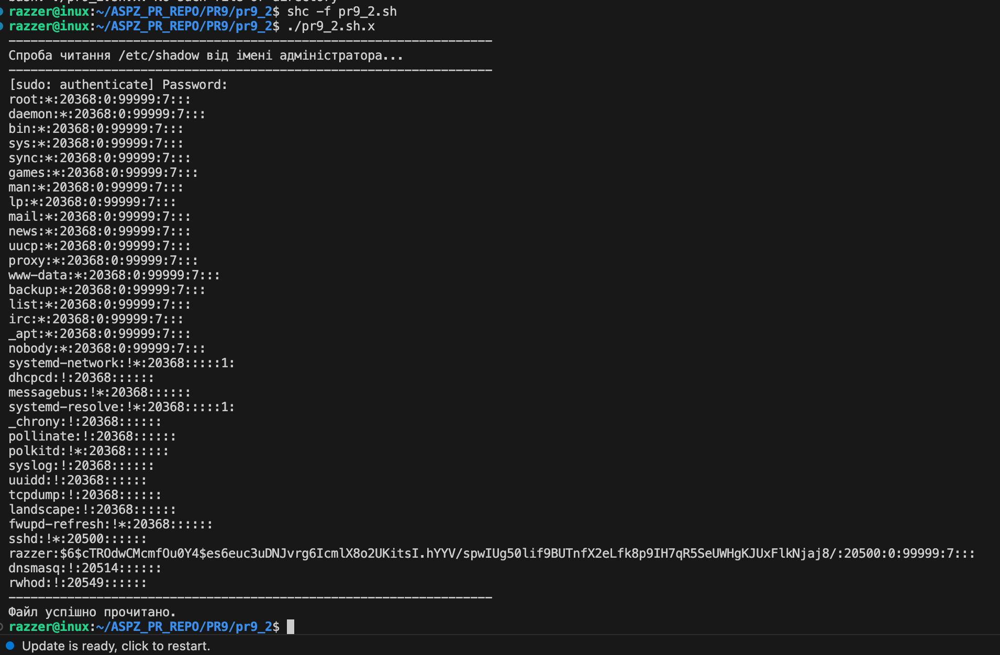
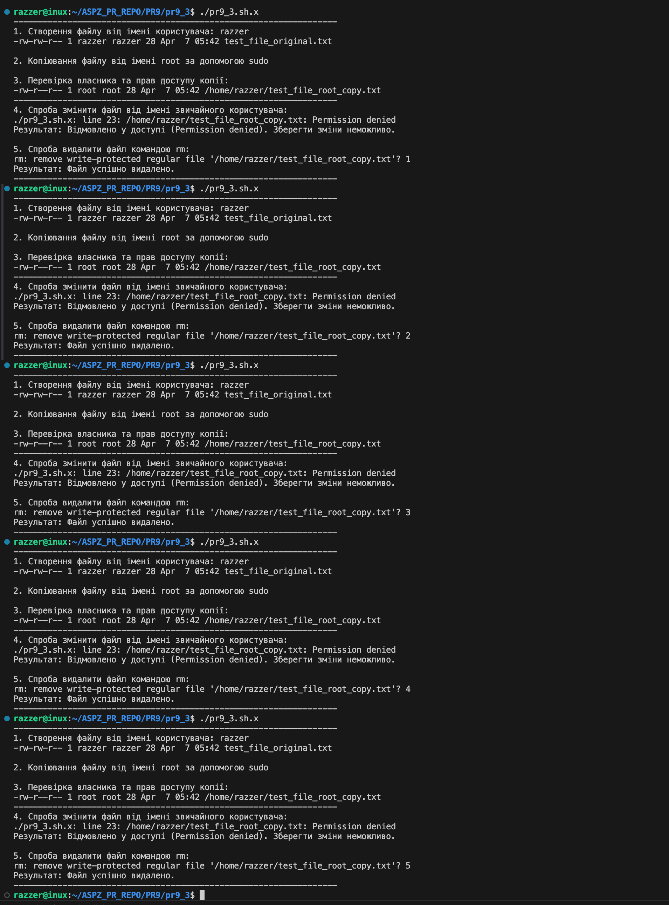
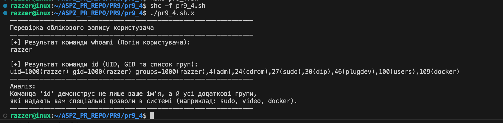
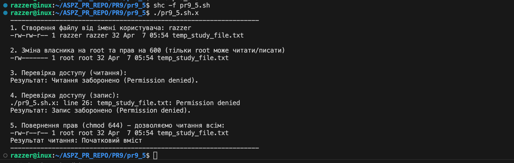
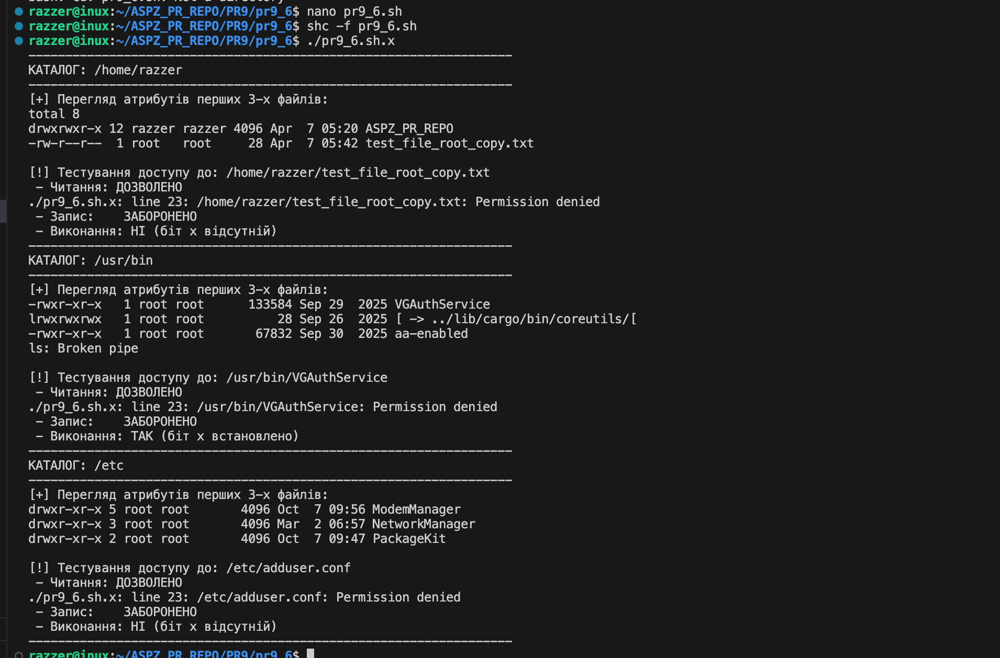

Практична робота №9

Завдання 1

Напишіть програму, яка читає файл /etc/passwd за допомогою команди getent passwd, щоб дізнатись, які облікові записи визначені на вашому комп’ютері.
Програма повинна визначити, чи є серед них звичайні користувачі (ідентифікатори UID повинні бути більші за 500 або 1000, залежно від вашого дистрибутива), окрім вас.

Опис

Програма використовує команду getent passwd для зчитування бази даних облікових записів та цикл із роздільником IFS=:, щоб виділити значення UID. Скрипт фільтрує користувачів з ідентифікаторами UID більшими або рівними 1000 (або 500), виключаючи поточного користувача за допомогою id -u, та виводить список знайдених звичайних записів.

Ідея реалізації

Програма реалізована як Bash-скрипт, який за допомогою команди getent passwd отримує список усіх облікових записів та обробляє їх у циклі через роздільник двокрапку. Алгоритм порівнює UID кожного запису з пороговим значенням 1000 і виводить дані лише тих користувачів, чий ідентифікатор відповідає критерію звичайного користувача та не збігається з UID автора скрипта.

Приклад роботи

Збірка та запуск

shc -f pr9_1.sh
./pr9_1.sh.x

============================================================================================

Завдання 2

Напишіть програму, яка виконує команду cat /etc/shadow від імені адміністратора, хоча запускається від звичайного користувача.
(Ваша програма повинна робити необхідне, виходячи з того, що конфігурація системи дозволяє отримувати адміністративний доступ за допомогою відповідної команди.)

Опис

Програма реалізована як Bash-скрипт, який використовує команду sudo для отримання привілеїв суперкористувача при зверненні до захищеного файлу /etc/shadow. Доступ до вмісту файлу стає можливим завдяки налаштуванням системи, що дозволяють звичайному користувачу делегувати адміністративні права для виконання конкретних операцій.

Ідея реалізації

Програма реалізована як Bash-скрипт, який використовує команду sudo для отримання привілеїв суперкористувача при зверненні до захищеного файлу /etc/shadow. Доступ до вмісту файлу стає можливим завдяки налаштуванням системи, що дозволяють звичайному користувачу делегувати адміністративні права для виконання конкретних операцій.

Приклад роботи

Збірка та запуск

shc -f pr9_2.sh
./pr9_2.sh.x

============================================================================================

Завдання 3

Напишіть програму, яка від імені root копіює файл, який вона перед цим створила від імені звичайного користувача. Потім вона повинна помістити копію у домашній каталог звичайного користувача.
Далі, використовуючи звичайний обліковий запис, програма намагається змінити файл і зберегти зміни. Що відбудеться?
Після цього програма намагається видалити цей файл за допомогою команди rm. Що відбудеться?

Опис

Програма демонструє, що при копіюванні файлу через sudo, його власником стає root, що унеможливлює модифікацію вмісту звичайним користувачем (помилка Permission denied). Водночас тест підтверджує, що право на видалення файлу залежить не від власника самого файлу, а від прав доступу до каталогу, тому користувач зміг видалити захищений файл у власному домашньому каталозі.

Ідея реалізації

Алгоритм базується на створенні тимчасового об'єкта, зміні його атрибутів через делегування привілеїв (sudo cp) та подальшій перевірці системних обмежень при спробах запису та видалення. Програма використовує аналіз кодів повернення команд для підтвердження того, що права на рівні файлу (заборона запису) не блокують права на рівні директорії (дозвіл на видалення).

Приклад роботи

Збірка та запуск

shc -f pr9_3.sh
./pr9_3.sh.x

============================================================================================

Завдання 4

Напишіть програму, яка по черзі виконує команди whoami та id, щоб перевірити стан облікового запису користувача, від імені якого вона запущена.
Є ймовірність, що команда id виведе список різних груп, до яких ви належите. Програма повинна це продемонструвати.

Опис

Програма демонструє різницю між поверхневою ідентифікацією через whoami та детальним аналізом прав доступу за допомогою команди id. Виконання скрипта наочно показує структуру групових привілеїв користувача, що є ключовим фактором при визначенні його повноважень у файловій системі.

Ідея реалізації

Програма послідовно викликає системні утиліти whoami та id для отримання поточної ідентифікації користувача в середовищі Linux. Основна логіка полягає у порівнянні короткого імені користувача з повним технічним описом його ідентифікаторів (UID/GID) та переліком усіх груп доступу, до яких він входить.

Приклад роботи

Збірка та запуск

shc -f pr9_4.sh
./pr9_4.sh.x

============================================================================================
Завдання 5

Напишіть програму, яка створює тимчасовий файл від імені звичайного користувача. Потім від імені суперкористувача використовує команди chown і chmod,
щоб змінити тип володіння та права доступу.
Програма повинна визначити, в яких випадках вона може виконувати читання та запис файлу, використовуючи свій обліковий запис.

Опис

Програма демонструє динамічну зміну атрибутів файлу за допомогою команд chown та chmod, що призводить до повної втрати прав доступу звичайним користувачем. Тест підтверджує, що при встановленні прав 600 та зміні власника на root, система блокує спроби читання та запису, і лише часткове повернення прав (режим 644) дозволяє знову переглядати вміст файлу без можливості його редагування.

Ідея реалізації

Алгоритм базується на послідовному перехопленні прав власності адміністратором (sudo chown) та тестуванні операцій введення-виведення на кожному етапі. Програма використовує обробку стандартних потоків помилок та аналіз статусів виконання для виявлення моментів, коли права на рівні власника (owner) стають вищими за права фактичного творця файлу.

Приклад роботи

Збірка та запуск

shc -f pr9_5.sh
./pr9_5.sh.x

============================================================================================

Завдання 6

Напишіть програму, яка виконує команду ls -l, щоб переглянути власника і права доступу до файлів у своєму домашньому каталозі, в /usr/bin та в /etc.
Продемонструйте, як ваша програма намагається обійти різні власники та права доступу користувачів, а також здійснює спроби читання, запису та виконання цих файлів.

Опис

Програма аналізує розмежування прав доступу в ОС Linux, демонструючи, що звичайний користувач має повний контроль у власному каталозі, але обмежений лише читанням або виконанням у системних папках. Скрипт наочно показує, що спроби обійти власника через прямий запис у файли в /etc або /usr/bin блокуються ядром системи на рівні перевірки ідентифікаторів UID.

Ідея реалізації

Програма автоматизує перевірку трьох ключових зон файлової системи, виконуючи команду ls -l для візуального аналізу та практичні спроби операцій введення-виведення. Алгоритм порівнює результати в домашній папці (де користувач має повні права) із системними директоріями /etc та /usr/bin, де права обмежені власником root.

Приклад роботи

Збірка та запуск

gcc -g pr9_6.c -o pr9_6
./pr9_6

============================================================================================

Завдання 10

Визначте, які приховані механізми можуть дати доступ до закритого ресурсу без зміни прав доступу.

Опис

Прихованими механізмами, які дозволяють отримати доступ до закритих ресурсів без прямої зміни прав доступу, є насамперед Linux Capabilities, SUID-біт та ACL. Механізм Capabilities дозволяє розділити повноваження суперкористувача на окремі привілеї, наприклад, атрибут CAP_DAC_OVERRIDE надає процесу можливість повністю ігнорувати перевірки прав читання та запису, залишаючись непомітним для стандартної команди ls -l. Спеціальний біт SUID дозволяє програмі запускатися з правами її власника, що дає звичайному користувачу можливість через такий файл діяти від імені адміністратора. Додатково система може використовувати списки керування доступом ACL, які прописують індивідуальні дозволи для конкретних користувачів поза стандартною схемою власника та групи, що візуально позначається лише символом плюс у списку файлів. Такі інструменти дозволяють гнучко обходити класичну модель розмежування прав, забезпечуючи доступ до даних на рівні системних викликів ядра або специфічних атрибутів файлової системи.

